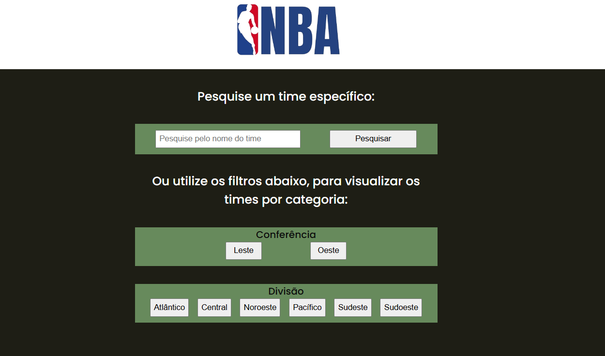

<h1 align="center"> Projeto NBA</h1>

Listar Times NBA

  <a href="#-tecnologias">Tecnologias</a>&nbsp;&nbsp;&nbsp;|&nbsp;&nbsp;&nbsp;
  <a href="#-projeto">Projeto</a>

 

  

## 🚀 Tecnologias 

Esse projeto foi desenvolvido com as seguintes tecnologias:

- HTML e CSS
- Javascript

## 💻 Projeto

Site que agrupa algumas informações de todos os times da NBA, organizando em tabelas que podem ser filtradas, há também um mecanismo de busca para algum time específico. Todos os dados são consumidos por uma API externa pública.

A api consumida possuí limitações de até 5 requisições por minuto devido ao plano gratuito para uso da mesma.

---
